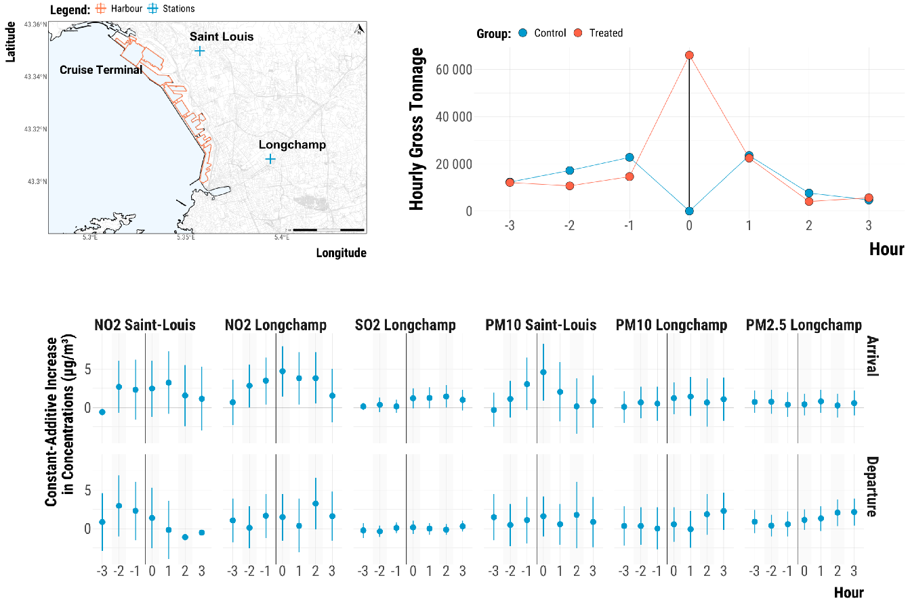
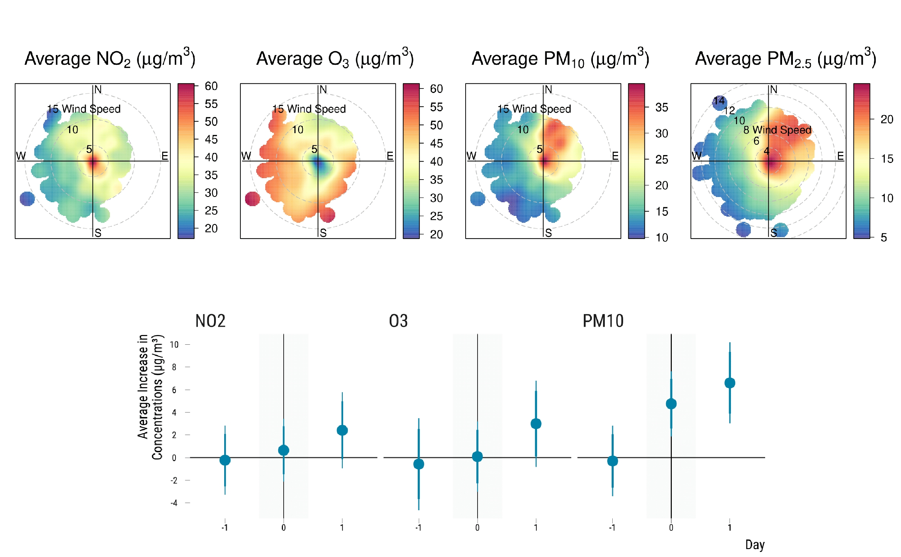
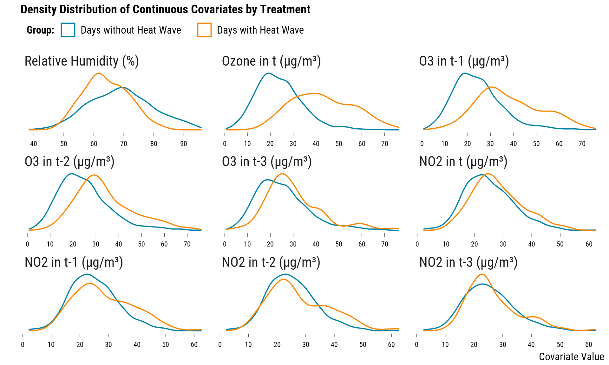

<style>
body {
text-align: justify}
</style>

# Why Acute Health Effects of Air Pollution Could Be Inflated

with [Vincent Bagilet](https://vincentbagilet.github.io/) (PhD student, Columbia University), **Job Market Paper**.

```{r, echo = FALSE}
knitr::include_graphics("images/jmp.png")
```

Accurate and precise measurements of the short-term effects of air pollution on
health play a key role in setting air quality standards. Yet, statistical power
calculations are rarely—if ever—carried out. We first collect estimates and
standard errors of all available articles found in the standard epidemiology
and economics literatures. We find that nearly half of them may suffer from
a low statistical power and could thereby produce statistically significant estimates
that are actually inflated. We then run simulations based on real data to
identify which parameters of research designs affect statistical power. Despite
their large sample sizes, we show that studies exploiting rare exogenous shocks
such as transport strikes or thermal inversions could have a very low statistical
power, even for plausibly large effect sizes. Our simulation results indicate
that the observed discrepancy in the literature between instrumental variable
estimates and non-causal ones could be partly explained by the inherent imprecision
of the two-stage least-squares estimator. We also provide evidence that
subgroup analysis on the elderly or children should be implemented with caution
since the average number of events for an health outcome is a major driver
of power. Based on these findings, we build a series of recommendations for researchers
to evaluate the design of their study with respect to statistical power
issues.

Click [here](job_market_paper.pdf) to download the most recent version of the paper. Replication materials and additional results can be found on this [website](https://vincentbagilet.github.io/inference_pollution/).

# Estimating the Causal Effects of Cruise Traffic on Air Pollution using Randomization-Based Inference 

with [Marion Leroutier](https://marionleroutier.weebly.com/) (Misum, Stockholm School of Economics) & [Marie-Abèle Bind](https://scholar.harvard.edu/marie-abele/home) (Massachusetts General Hospital), Working Paper submitted.

```{r, echo = FALSE}

```

Local environmental organizations and media have recently expressed concerns over air pollution induced by maritime traffic and its potential adverse health effects on the population of Mediterranean port cities. We explore this issue with unique high-frequency data from Marseille, France's largest port for cruise ships, over the 2008-2018 period. Using a new pair-matching algorithm designed for time series data, we create hypothetical randomized experiments and estimate the variation in air pollutant concentrations caused by a short-term increase in cruise vessel traffic. We carry out a randomization-based approach to compute 95\% Fisherian intervals (FI) for constant treatment effects consistent with the matched data and the hypothetical intervention. At the hourly level, cruise vessels' arrivals increase concentrations of nitrogen dioxide (NO$_{2}$) by 4.7 µg/m$^3$ (95\% FI: [1.4, 8.0]), of sulfur dioxide (SO$_{2}$) by 1.2 µg/m$^3$ (95\% FI: [-0.1, 2.5]), and of particulate matter (PM$_{10}$) by 4.6 µg/m$^3$ (95\% FI: [0.9, 8.3]). At the daily level, cruise traffic increases concentrations of NO$_{2}$ by 1.2 µg/m$^3$ (95\% FI: [-0.5, 3.0]) and of PM$_{10}$ by 1.3 µg/m$^3$ (95\% FI: [-0.3, 3.0]). Our results suggest that well-designed hypothetical randomized experiments provide a principled approach to better understand the negative externalities of maritime traffic.

[Arxiv Preprint](https://arxiv.org/abs/2105.03996), [OSF Preprint](https://osf.io/v7ctk/), [Replication Materials](https://osf.io/v8aps/).

# Measuring the Influence of Wind on Air Pollution Using a Causal Inference Pipeline

with [Anna Alari](https://scholar.google.com/citations?user=MiFY320AAAAJ&hl=fr) (ISGlobal) and [Tarik Benmarhnia](https://profiles.ucsd.edu/tarik.benmarhnia) (UC San Diego), Working Paper submitted.

```{r, echo = FALSE}

```

Changes in wind patterns can substantially alter the air pollution level of a city. It is however not straightforward to statistically estimate  this relationship. Since wind variations are not randomly distributed over time and are related to other weather parameters influencing air pollution, researchers must adjust for these confounding factors. As an alternative to current practices, we implement a causal inference pipeline to embed an observational study within an hypothetical randomized experiment. We illustrate this new approach for air pollution studies using 4018 daily observations from Paris, France, over the 2008-2018 period. Following the Neyman-Rubin potential outcomes framework, we first define our treatment of interest as the effects on several air pollutant concentrations of North-East winds (824 units) compared to other wind directions (3194 units). We then use a matching algorithm to approximate a pair randomized experiment resulting only in 119 matched pairs. By pruning many units, matching allows us to adjust nonparametrically for observed confounders while avoiding model extrapolation to treated days without similar control days. Once the balance of treated and control groups was deemed satisfactory, we estimate the average differences in air pollutant concentrations and their sampling variability using Neymanian inference. We find that North-East winds increase PM$_{10}$ concentrations by 4.8 µg/m$^3$ (95\% CI: 2.6, 6.9). As in any observational studies, an unobserved confounder could bias our results. We therefore carry out a sensitivity analysis which reveals that an unobserved variable 2 times more common among treated units could make our data compatible with small negative effects up to very large effects (95\% CI: -0.5, 10.6). Our causal inference approach should make researchers aware that finding the subset of similar observations to estimate more credibly the effects of wind patterns on air pollution may be more difficult than previously thought.


# The importance of implementing a design stage in environmental epidemiology

with Tarik Benmarhnia and Marie-Abele Bind, New version available in November 2021.

```{r, echo = FALSE}

```
 
Although the use of causal inference methods has recently increased in the epidemiological literature, these approaches are still underused in environmental epidemiology. In this paper, we review traditional and modern matching algorithms available to environmental epidemiologists and we illustrate the benefit of balancing covariates using a motivating example that, we hope, should resonate to environmental epidemiologists. We first introduce the potential outcomes framework and the standard, necessary assumptions about the assumed assignment mechanism to address causality. Using a real environmental data set, we conducted a simulation study of the effect of heat waves on daily number of years of life lost (YoLL). More specifically, we simulated the daily potential outcomes had the heat wave occurred. The true effect of heat wave was set to 230 daily YoLL. We analyzed the simulated data using traditional multivariable regression methods and using propensity score matching, which led to a matched dataset with 210 pairs of days (with and without heat wave) similar with respect to the previous lags of daily temperature, NO2, ozone, humidity, and calendar variables. Using traditional regression approaches, heat waves were associated with 339 daily YoLL [95%CI: 321; 357]. Using the PSM approach, the estimated causal effect of heat waves on YoLL was 220 YoLL [95%CI: 155; 285]. We discuss the benefit of balancing pre-exposure covariates before estimating the health impacts of environmental factors and discuss advantages and limitations of balancing methods. 


# Work in Progess

Below is a list of works for which drafts will be available in early 2022.

### The Trade-Off Between Omitted Variable Bias and Type M Error

with Vincent Bagilet.

In this project, we illustrate with simple fake-data simulations why the
trade-off between omitted variable bias and Type M error should be more systematically
into account. In some contexts, the omitted variable bias can be relatively small. If
we overcome this bias by exploiting an under-powered causal inference
method, we can run a type M error that could be potentially larger than the omitted
variable bias. To take into account this trade-off, we recommend to (i) carry out retropower calculations to better assess the statistical power of our studies against a range of plausible effect sizes and (ii) implement quantitative bias analysis to check to which extent unobserved confounders could bias our results.


### Improving Instrumental Variables Design to Better Estimate the Acute Health Effects of Air Pollution

with Tarik Benmarhnia.

Instrumental variable designs have been increasingly used to estimate the short-term effects of air pollutants on mortality and morbidity. Using the data of several flagship publications, we will show (i) how to improve observed covariates balances and avoid model extrapolation using several matching algorithms (and especially near-far matching which is specifically designed for IVs), (ii) how to carry out a quantitative bias analysis to both a naive and an IV strategy suffer from omitted variable bias and (iii) use simulations to understand when the correlation among air pollutants can be really an issue for the exclusion restriction.


### The Effects of Air Pollution Exposure during Pregnancy on Children’s Health

with Marion Davin & Emmanuelle Lavaine (University of Montpellier).

Mothers exposed to high air pollution are often very different from the ones living in low air pollution areas. The resulting lack in observed covariates makes it difficult to estimate credibly the effect of air pollution exposure during pregnancy on birth weight and later child's outcomes. Using data on 18,000 children from the French ELFE cohort,  we implement a cardinality matching procedure to find similar pairs of mothers exposed to high and low levels of ambient air pollutants (Giancarlo Visconti and José R. Zubizarreta, *Observational Studies*, 2018). We then rely on randomization-inference to estimate the range of treatment effects consistent with the data and finally carry out a sensitivity analysis to test if unobserved confounders could alter the results.

# Other Works

Below is the list of works for which I was not the principal investigator.

### The effects of an air quality alert program on premature mortality: A difference-in-differences evaluation in the region of Paris

Anna Alari, Lara Schwarz, Léo Zabrocki, Géraldine Le Nir, Basile Chaix, Tarik Benmarhnia, [International Environment](https://www.sciencedirect.com/science/article/pii/S0160412021002087) (2021). *Remark*: I carefully read the paper and provided comments.


**Background:** Daily exposure to air pollution has been shown to increase cardiovascular and respiratory mortality.
While increases in short-term exposure to air pollutants at any daily concentrations has been shown to be
associated to adverse health outcomes, days with extreme levels, also known as air pollution peaks based on
specific thresholds, have been used to implement air quality alerts in various cities across the globe.
Objectives: We aimed at evaluating the potential effects of the Air Quality Alerts (AQA) system on different causes
of premature mortality in Paris, France.

**Methods:** Air quality alerts (AQA) based on particulate matter (PM10) levels and related interventions were
implemented in the region of Paris in 2008 and were revised to be more stringent in 2011. In this study, we
applied a difference-in-differences (DID) approach coupled with propensity-score matching (PSM) to daily
mortality data for the period 2000 to 2015 to evaluate the effects of the Paris AQA program on different causes of
premature mortality for the entire population and for adults > 75 years old.

**Results:** Overall, results did not show evidence of a reduction in mortality of the PM10 AQA program when first
implemented in 2008 with initial thresholds (80 $\mu g/m^3$); DID estimates were slightly above 1 for cardiovascular
and respiratory mortality. However, when evaluating the drastic reduction in revised thresholds in 2011 (50 $\mu g/m^3$) to trigger interventions, we identified a reduction in cardiovascular (DID = 0.84, 95% CI: 0.755 to 0.930)
mortality, but no change in respiratory mortality was detected (DID = 0.97, 95% CI: 0.796, 1.191).

**Discussion:** Our study suggests that AQA may not have health benefits for the population when thresholds are set
at high daily PM10 levels. Given that such policies are implemented in many other metropolitan areas across the
globe, evaluating the effectiveness of AQA is important to provide public authorities and researchers a rationale
for defining specific thresholds and extending the scope of these policies to lower air pollution levels. 


### Individual and Environmental Risk Factors for COVID-19 Mortality in Elderly

Thomas Bourdrel, Leo Zabrocki, Nathalie Compte, Romain Descours, Hélène Pelerin, Laure De
Decker, Laurence Le Jumeau de Kergaradec, Mathieu Lilamand, Claire Roubaud Baudron, Bertrand Fougères, Rachid Mahmoudi, Benoit Schorr, Georges
Kaltenbach and Thomas Vogel, Submitted. *Remark*: I was in charge of the statistical analysis.The replication can be found at this [link](https://github.com/lzabrocki/covid_air_pollution).

Several studies have already explored individual and environmental risk factors for COVID-
19 morality, however most study populations consisted of the overall population and mainly
from China or the US. Our study focused on COVID-19 mortality in the elderly in seven
European cities. Long-term exposure to air pollution was estimated through annual pollutant
concentrations at the residential address averaged over the last two years of the study period
between February and May 2020. We focused on the main outdoor air pollutants PM$_{10}$, PM$_{2.5}$,
NO$_{2}$ and O$_{3}$. Short-term variations in air pollutants and weather parameters (e.g., temperature,
UV, relative humidity) were also examined through a 20-day period before the confirmed
PCR diagnostic of COVID-19. Individual risk factors such as smoking status, sex, body mass
index (BMI), ischemic heart disease, diabetes, hypertension, chronic renal failure, history of
cancer, COPD, and lung fibrosis, were taken into account. We found positive associations for
diabetes and COVID-19 mortality (OR 2.2 CI 95% :1.1, 4.4). Using a multivariate logistic
regression model adjusted for all patient characteristics and city, we fail to reject the null
hypothesis of no association between COVID-19 mortality and long-term and short-term
increase in PM$_{2.5}$, PM$_{10}$, NO$_{2}$ and O$_{3}$. Our study suffers from the fact that patient profiles
strongly differ between high-polluted and less-polluted cities. Strong differences in COVID-
19 mortalities were observed between cities, which could be due to differences in COVID-19
management and treatment, such as accessibility to reanimation and intensive units between
cities. Overall, our study highlights the need to improve estimation of individual exposure to
air pollution. Indeed, even with the high-efficiency modelisation systems used in our study,
we were unable to estimate the effect of air pollution within each city, because variations in
air pollution exposure were too small. Individual markers of air pollution exposure such as
recently demonstrated with urinary black carbon or passive individual samplers, would be
most suitable for future explorations. Concerning weather parameters, although previous
studies concluded that increase in temperature and UV index could decrease COVID-19
morality, our data did not allow us to reject the null hypotheses.
